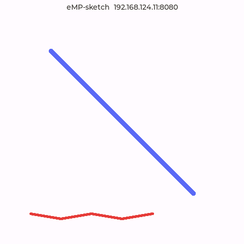

# eMP-sketch

网页绘制、**T113-S3 同屏显示**的 LVGL 无限画布白板。手机 / PC 在浏览器里画，板屏实时同步出笔触。

v0.1 为**单向镜像**：浏览器 → 板子（板子只接收渲染，不回发）。架构上是「场景图 + 视口」，为后续图片贴图、图层、多人协作预留了扩展点。

## 特性（v0.1）

- 画笔（颜色 / 粗细）+ 无限画布平移缩放 + 视口跟随板屏
- 浏览器与板端共享同一套「世界坐标 + 视口变换」，拖动/缩放时板屏跟着动
- 板端软件渲染器：笔画 Bresenham + 圆形印章，直接写 RGB565 帧缓冲，无 GPU 依赖
- HTTP 静态托管（板子自带网页）+ WebSocket（笔画/视口/清空消息）
- 双后端：桌面 SDL（先跑通再上板）+ T113 fbdev/evdev 交叉编译

## 架构

```
浏览器 (web/paint.js)
   │  ① 世界坐标笔画 + 视口(scale, x, y)
   │  ② WebSocket (cpp-httplib)
   ▼
板端 (T113-S3 / SDL 桌面)
   ├─ net/ws_server    HTTP 静态托管 + WS 消息解析(nlohmann/json)
   ├─ core/whiteboard  场景图(笔画列表) + 视口 + 软件渲染 → RGB565 帧缓冲
   ├─ view              LVGL canvas 呈现帧缓冲 + 顶部状态栏(IP:port)
   └─ hal               SDL 窗口 / fbdev 显示
```

**视口变换**：`screen = (world - offset) * scale`，网页与板端用同一公式，拖动/缩放只同步 `viewport` 一条消息（几十字节），不同步整帧。

**图片解码/裁剪/几何运算全部留在浏览器**（浏览器 CPU 强），板子只 blit——这是 T113 无 GPU 前提下的关键取舍，后续加图片贴图/旋转/裁剪也不会拖垮板端。

## 目录结构

```
eMP-sketch/
├── CMakeLists.txt            # SDL 桌面 + T113 交叉双模式
├── lv_conf.h                 # LVGL v9 官方模板改值（LV_COLOR_DEPTH=16, 60fps）
├── repos.json / fetch_repos.py / bootstrap.sh   # 拉取 lvgl / httplib / nlohmann
├── cmake/build_for_t113s3.cmake   # 委托 eMP-toolchain 的交叉工具链
├── src/
│   ├── main.cpp              # 装配：HAL + WS 线程 + 白板 + 主循环
│   ├── core/sketch_types.hpp # Stroke / Viewport / rgb565
│   ├── core/whiteboard.*     # 场景图 + 视口 + 软件渲染器
│   ├── net/ws_server.*       # cpp-httplib HTTP+WS，nlohmann 解析
│   ├── view/whiteboard_view.*# LVGL canvas + 状态栏
│   └── hal/sketch_lvgl_hal.* # SDL / fbdev 显示驱动
└── web/                      # index.html + style.css + paint.js
```

## 构建

### 桌面（SDL，先跑通再上板）

```bash
./bootstrap.sh                          # 拉取依赖
cmake -S . -B build/sdl -DSKETCH_USE_SDL=ON
cmake --build build/sdl -j$(nproc)
./dist/eMP-sketch                       # 打开 SDL 窗口
```

浏览器打开 `http://localhost:8080`，鼠标画、滚轮缩放、按住中键/切「抓手」平移，SDL 窗口同步出笔触。

### T113-S3 交叉编译

```bash
export T113_SDK=/path/to/eMP-toolchain
export STAGING_DIR=$T113_SDK/sysroot
cmake -S . -B build/t113 \
      -DCMAKE_TOOLCHAIN_FILE=cmake/build_for_t113s3.cmake \
      -DT113_SDK=$T113_SDK
cmake --build build/t113 -j$(nproc)
```

产物 `dist/eMP-sketch` 部署到板子，把 `web/` 目录一起拷到板端（或用 `SKETCH_WEB_ROOT` 指定路径）：

```bash
scp dist/eMP-sketch root@<board-ip>:/root/
scp -r web root@<board-ip>:/root/
# 板端运行
SKETCH_WEB_ROOT=/root/web ./eMP-sketch
```

板屏顶部会显示 `eMP-sketch  <ip>:8080`，手机/PC 连同一网段，浏览器打开该地址即可画。

### 板端验证

T113-S3（192.168.124.11）实测：WebSocket 推入两条笔画（靛蓝对角 + 红色波浪）即时同步到 fb0，顶部状态栏显示本机 IP 与端口。



## WebSocket 协议

一条消息 = 一段笔画 / 一个视口 / 一次清空：

```jsonc
{ "type": "draw",  "color": "#37352F", "width": 3, "points": [[x,y],[x,y],...] }
{ "type": "viewport", "scale": 1.0, "x": 0.0, "y": 0.0 }
{ "type": "clear" }
```

`points` 为**世界坐标**，板端按当前视口变换落点。颜色 `#RRGGBB` → RGB565。

## 环境变量

| 变量 | 默认 | 说明 |
|---|---|---|
| `SKETCH_WS_PORT` | `8080` | HTTP/WS 监听端口 |
| `SKETCH_WEB_ROOT` | 编译期 `web/` 路径 | 静态资源目录 |
| `SKETCH_FBDEV_DEVICE` | `/dev/fb0` | framebuffer 设备 |
| `SKETCH_EVDEV_TOUCH` | `/dev/input/event1` | evdev 触摸设备 |
| `SKETCH_SDL_ZOOM` | `1.0` | SDL 窗口缩放 |

## 设计语言

编辑部极简（Notion/Linear 风）：暖白纸面 `#FAFAF8`、墨色 `#37352F`、极细描边、一套低饱和「设计师色」画笔、单一强调色。板端因 RGB565 无 alpha / 软件渲染，统一做扁平降级。

## 路线图

- **v0.2**：图片贴图（拖/缩/转/裁，浏览器解码后发 RGB565）、图层、撤销/重做、断线重连快照、GIF 贴纸
- **v0.3**：多人共画、板端手指画（双向）、画作回放、二维码扫码开画

## License

MIT
